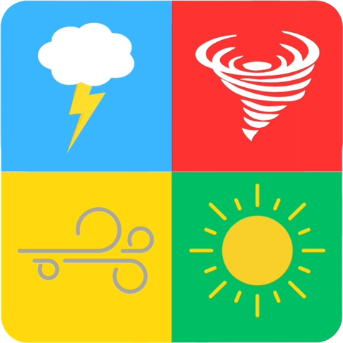
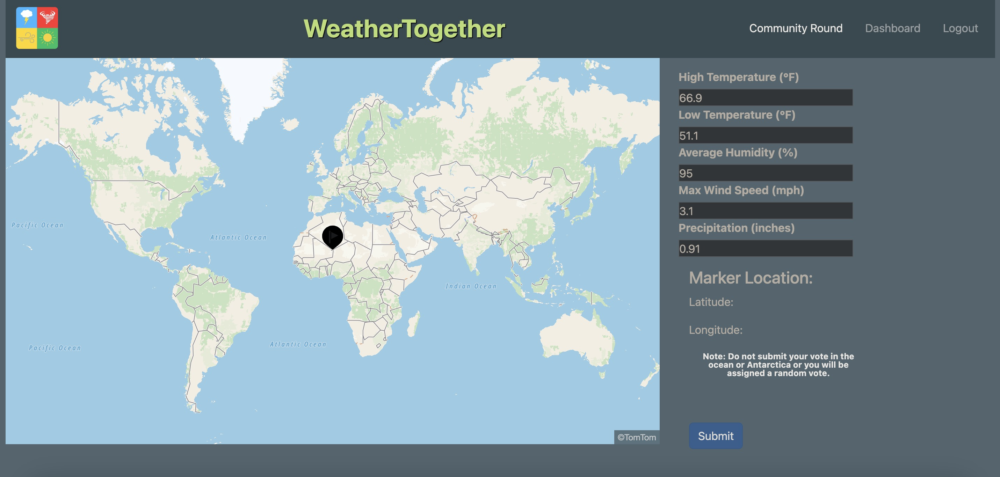

<a name="readme-top"></a>
<!-- PROJECT SHIELDS -->
[![Contributors][contributors-shield]][contributors-url]
[![Forks][forks-shield]][forks-url]
[![Stargazers][stars-shield]][stars-url]
[![Issues][issues-shield]][issues-url]


<!-- PROJECT LOGO  -->
<br />
<div align="center">
  <a href="https://github.com/Weather-Together/weather_together_fe">
    
  </a>

<h3 align="center">Weather Together</h3>

  <p align="center">
    Weather Together is a game app where a daily set of weather data is displayed to the user (player) from a randomly selected location in the world. Each day the player guesses a location where they think this weather data was collected through an interactive map selector. They are able to keep track of prior guesses as well as track their progress on a leaderboard.

The goal of this app is to provide public education and increase awareness of general global climate trends in a fun and interactive manner.
    <br />
    <a href="https://github.com/Weather-Together/weather_together_fe"><strong>Explore the docs »</strong></a>
    <br />
    <br />
    <a href="https://github.com/Weather-Together/weather_together_fe">View Demo</a>
    ·
    <a href="https://github.com/Weather-Together/weather_together_fe/issues">Report Bug</a>
    ·
    <a href="https://github.com/Weather-Together/weather_together_fe/issues">Request Feature</a>
  </p>
</div>


<!-- TABLE OF CONTENTS -->
<details>
  <summary>Table of Contents</summary>
  <ol>
    <li>
      <a href="#about-the-project">About The Project</a>
      <ul>
        <li><a href="#built-with">Built With</a></li>
        <li><a href="#gems">Gems</a></li>
      </ul>
    </li>
    <li>
      <a href="#getting-started">Getting Started</a>
      <ul>
        <li><a href="#prerequisites">Prerequisites</a></li>
        <li><a href="#installation">Installation</a></li>
      </ul>
    </li>
    <li><a href="#usage">Usage</a></li>
    <li><a href="#roadmap">Roadmap</a></li>
    <li><a href="#contact">Contact</a></li>
    <li><a href="#contributers">Contributers</a></li>
  </ol>
</details>


<!-- ABOUT THE PROJECT -->
## About The Project



[](https://weather-together.onrender.com/)

<p align="right">(<a href="#readme-top">back to top</a>)</p>


### Built With

* [![Bootstrap][Bootstrap.com]][Bootstrap-url]

<p align="right">(<a href="#readme-top">back to top</a>)</p>

### Gems

* [![saasc-rails][gem-saasc-rails]][gem-saasc-rails-url]
* [![faraday-rails][gem-faraday-rails]][gem-faraday-rails-url]
* [![omniauth-google-oauth2][gem-omniauth-google-oauth2]][gem-omniauth-google-oauth2-url]
* [![rspec-rails][gem-rspec-rails]][gem-rspec-rails-url]
* [![capybara][gem-capybara]][gem-capybara-url]
* [![simplecov][gem-simplecov]][gem-simplecov-url]
* [![webmock][gem-webmock]][gem-webmock-url]
* [![vcr][gem-vcr]][gem-vcr-url]
* [![factory_bot_rails][gem-factory_bot_rails]][gem-factory_bot_rails-url]
* [![faker][gem-faker]][gem-faker-url]
* [![pry][gem-pry]][gem-pry-url]
* [](https://rubygems.org/gems/selenium-webdriver)
* [](https://rubygems.org/gems/nokogiri)
* [](https://rubygems.org/gems/launchy)


<p align="right">(<a href="#readme-top">back to top</a>)</p>

<!-- GETTING STARTED -->
## Getting Started

To get a local copy up and running follow these simple example steps.

### Prerequisites

UPDATE WITH ANY OR REMOVE

### Installation

1. Get a free TomTom API Key at [https://developer.tomtom.com/](https://developer.tomtom.com/knowledgebase/platform/articles/how-to-get-an-tomtom-api-key/) and a Google client ID and secret ID [here](https://console.cloud.google.com/getting-started?supportedpurview=project) and follow [these](https://www.balbooa.com/help/gridbox-documentation/integrations/other/google-client-id) instructions

2. Clone the repo
   ```sh
   git clone https://github.com/Weather-Together/weather_together_fe.git
   ```
3. Enter your API in `UPDATE ON WHERE LATER`
   ```sh
   EDITOR="code --wait" rails credentials:edit
   ```
    In editor pop up
    ```ruby
  
    tomtom:
      key: <YOUR API KEY>
    google:
     client_id: <YOUR CLIENT ID>
     secret_id: <YOUR SECRET ID>
    ```
4.  Gem Bundle
    ```sh
    bundle
    ```
5. Rake
   ```sh
    rails db:{drop,create,migrate,seed}
   ```

<p align="right">(<a href="#readme-top">back to top</a>)</p>


<!-- USAGE EXAMPLES -->
## Usage


This portion of the app handles the frontend functionality of the game:
* Handles user account creation, verification, and login.
* Provides the user interface for the app.
* Collects user input through location guesses on an externally consumed interactive map and passes this information to the backend portion of the application.
* Displays results to the user calculcated from the backend.

* [Google OAuth](https://developers.google.com/identity/protocols/oauth2) is utilized for secure and convenient user authentication. It allows users to sign in with their Google credentials, ensuring a streamlined and familiar login process.

<p align="right">(<a href="#readme-top">back to top</a>)</p>


<!-- ROADMAP -->
## Roadmap

- [ ] New User Creation
    - [ ] Information Input
    - [ ] Account verification and activation, through email link
- [ ] User Login (Basic)
- [ ] User Login (Expanded)
    - [ ] Two Factor Authentication
    - [ ] Passwordless Login
- [ ] Interactive Map Selector
    - [ ] Map Display
    - [ ] Pin Drop at a Lat/Lon
- [ ] User Dashboard
- [ ] Results 
- [ ] Mobile Functionality
- [ ] Decorator
- [ ] Addition of Private Games


See the [open issues](https://github.com/Weather-Together/weather_together_fe/issues) for a full list of proposed features (and known issues).

<p align="right">(<a href="#readme-top">back to top</a>)</p>


<!-- CONTACT -->
## Contact

Organization: Weather Together - WeatherTogether2308@gmail.com

Organization Link: [https://github.com/Weather-Together](https://github.com/Weather-Together)

Project Link: [https://github.com/Weather-Together/weather_together_fe](https://github.com/Weather-Together/weather_together_fe)

<p align="right">(<a href="#readme-top">back to top</a>)</p>


## Contributors

Michael Kuhlmeier 
 
[![LinkedIn][linkedin-shield]][linkedin-url-mk]
[![GitHub][github-shield-mk]][github-url-mk]

Blaine Kennedy 

[![LinkedIn][linkedin-shield]][linkedin-url-bk] 
[![GitHub][github-shield-bk]][github-url-bk]


John O'leary 

[![LinkedIn][linkedin-shield]][linkedin-url-jo] 
[![GitHub][github-shield-jo]][github-url-jo]

 Sam Tran 
 
 [![LinkedIn][linkedin-shield]][linkedin-url-st]
 [![GitHub][github-shield-st]][github-url-st]


Kevin Zolman 

[![LinkedIn][linkedin-shield]][linkedin-url-kz][![GitHub][github-shield-kz]][github-url-kz]


<!-- MARKDOWN LINKS & IMAGES -->
<!-- https://www.markdownguide.org/basic-syntax/#reference-style-links -->
[contributors-shield]: https://img.shields.io/github/contributors/Weather-Together/weather_together_fe.svg?style=for-the-badge
[contributors-url]: https://github.com/Weather-Together/weather_together_fe/graphs/contributors
[forks-shield]: https://img.shields.io/github/forks/Weather-Together/weather_together_fe.svg?style=for-the-badge
[forks-url]: https://github.com/Weather-Together/weather_together_fe/network/members
[stars-shield]: https://img.shields.io/github/stars/Weather-Together/weather_together_fe.svg?style=for-the-badge
[stars-url]: https://github.com/Weather-Together/weather_together_fe/stargazers
[issues-shield]: https://img.shields.io/github/issues/Weather-Together/weather_together_fe.svg?style=for-the-badge
[issues-url]: https://github.com/Weather-Together/weather_together_fe/issues
[license-shield]: https://img.shields.io/github/license/Weather-Together/weather_together_fe.svg?style=for-the-badge
[license-url]: https://github.com/Weather-Together/weather_together_fe/blob/master/LICENSE.txt
[linkedin-shield]: https://img.shields.io/badge/-LinkedIn-black.svg?style=for-the-badge&logo=linkedin&colorB=555
[linkedin-url-st]: https://www.linkedin.com/in/sam-t-tran
[linkedin-url-kz]: https://www.linkedin.com/in/kevin-zolman
[linkedin-url-mk]: https://www.linkedin.com/in/michaelkuhlmeier
[linkedin-url-bk]: https://www.linkedin.com/in/blaine-kennedy
[linkedin-url-jo]: https://www.linkedin.com/in/john-clay-oleary
[product-screenshot]: images/screenshot.png
[Bootstrap.com]: https://img.shields.io/badge/Bootstrap-563D7C?style=for-the-badge&logo=bootstrap&logoColor=white
[Bootstrap-url]: https://getbootstrap.com
[gem-saasc-rails]: https://img.shields.io/badge/sassc--rails-2.4.0-blue?style=flat-square&label=saasc-rails
[gem-saasc-rails-url]: https://github.com/sass/sassc-rails
[gem-faraday-rails]: https://img.shields.io/badge/faraday--rails-2.8.1-yellowgreen?style=flat-square
[gem-faraday-rails-url]: https://lostisland.github.io/faraday/#/
[gem-bootsnap]: https://img.shields.io/badge/bootsnap-1.17.0-critical?style=flat-square
[gem-bootsnap-url]: https://github.com/Shopify/bootsnap
[gem-omniauth-google-oauth2]: https://img.shields.io/badge/omniauth--google--oauth2-2.1.2-orange?style=flat-square
[gem-omniauth-google-oauth2-url]: https://github.com/zquestz/omniauth-google-oauth2
[gem-rspec-rails]: https://img.shields.io/badge/rspec--rails-5.0.0-green?style=flat-square
[gem-rspec-rails-url]: https://github.com/rspec/rspec-rails
[gem-capybara]: https://img.shields.io/badge/capybara-3.39.2-brightgreen?style=flat-square
[gem-capybara-url]: https://github.com/teamcapybara/capybara
[gem-simplecov]: https://img.shields.io/badge/simplecov-0.22.2-yellow?style=flat-square
[gem-simplecov-url]: https://github.com/simplecov-ruby/simplecov
[gem-webmock]: https://img.shields.io/badge/webmock-3.19.1-yellowgreen?style=flat-square
[gem-webmock-url]: https://github.com/bblimke/webmock
[gem-vcr]: https://img.shields.io/badge/vcr-6.2.0-orange?style=flat-square
[gem-vcr-url]: https://github.com/vcr/vcr
[gem-factory_bot_rails]: https://img.shields.io/badge/factory_bot_rails-6.4.5-success?style=flat-square
[gem-factory_bot_rails-url]: https://github.com/thoughtbot/factory_bot_rails
[gem-faker]: https://img.shields.io/badge/faker-3.2.2-red?style=flat-square
[gem-faker-url]: https://github.com/faker-ruby/faker
[gem-pry]: https://img.shields.io/badge/pry-0.14.2-yellow?style=flat-square
[gem-pry-url]: https://github.com/pry/pry

[github-shield-mk]: https://img.shields.io/badge/GitHub-mbkuhl-success?style=for-the-badge&logo=github
[github-url-mk]: https://github.com/mbkuhl

[github-shield-jo]: https://img.shields.io/badge/GitHub-Captainlearyo-success?style=for-the-badge&logo=github
[github-url-jo]: https://github.com/Captainlearyo

[github-shield-st]: https://img.shields.io/badge/GitHub-Sykogst-success?style=for-the-badge&logo=github
[github-url-st]: https://github.com/Sykogst

[github-shield-kz]: https://img.shields.io/badge/GitHub-zkevkev-success?style=for-the-badge&logo=github
[github-url-kz]: https://github.com/zkevkev

[github-shield-bk]: https://img.shields.io/badge/GitHub-bkchilidawg-success?style=for-the-badge&logo=github
[github-url-bk]: https://github.com/bkchilidawg
